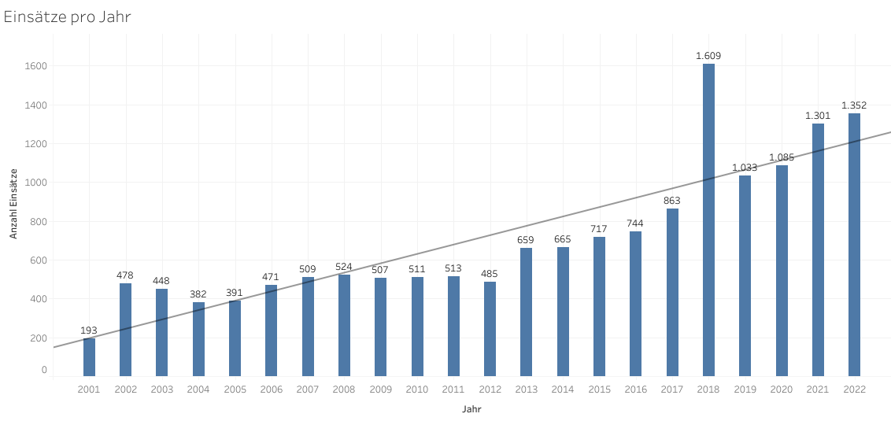
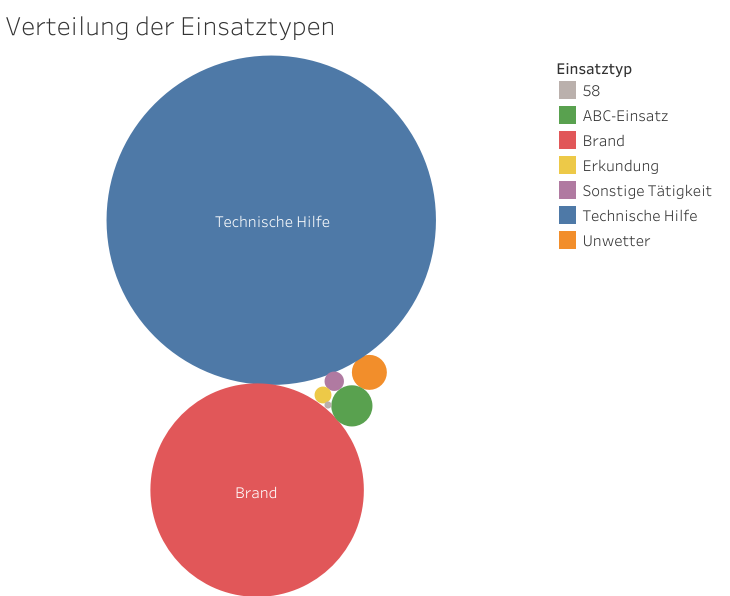

# Firefighting-operations-SW | Feuerwehreinsätze-SW | 🚒

Dieses Repository enthält eine Analyse von Feuerwehreinsätzen aus der Stadt und dem Landkreis Schweinfurt.

## Motivation 🌱
Ich bin aktives Mitglied der Freiwilligen Feuerwehr und zugleich leidenschaftlicher Data Scientist 💻. Da oft berichtet wird, dass die Einsatzzahlen von Jahr zu Jahr zunehmen, wollte ich diese Behauptung anhand von Statistiken des KFV Schweinfurt überprüfen. Leider konnte ich keine passenden Daten finden, jedoch stellt der KFV alle Einsätze online zur Verfügung. Also entschloss ich mich, diese Daten herunterzuladen, vorzubereiten, zu analysieren und zu visualisieren. Auf diese Weise kann ich meine Fähigkeiten im Bereich Data Science erweitern, neue Techniken kennenlernen und zahlreiche Erkenntnisse gewinnen.

## Daten
Die Daten stammen von der Webseite des [KFV Schweinfurt](https://www.kfv-schweinfurt.de/index.php/einsaetze/einsatzarchiv "KFV Schweinfut Webseite") und enthalten Informationen über alle Einsätze in Stadt und Landkreis Schweinfurt. Die Datensammlung beginnt am 19.05.2001 und wird täglich aktualisiert. Bitte beachten Sie, dass die Daten nur aus öffentlichen Quellen stammen und möglicherweise nicht vollständig oder fehlerfrei sind.

### Datenerfassung
Ich habe die Daten mithilfe von Webscraping von der Webseite extrahiert und heruntergeladen. Mein Datensatz umfasst alle Einsätze im Zeitraum vom 19.05.2001 bis zum 31.12.2022 und enthält insgesamt 15.440 Einträge. Das Scrapen der Daten dauert mindestens 2,5 Stunden 🕙, so wird sichergestellt, dass der Server unter den Anfragen nicht zusammenbricht und auch für andere Anfragen immer erreichbar bleibt. Das Scrapen der Daten ist auch mit einem Raspberry Pi möglich (getestet mit einem Raspberry Pi 3 Model B). Um sicherzustellen, dass alle Einsätze heruntergeladen werden, dürfen während des Downloads keine neuen Einsätze hinzu kommen.

### Dataset erstellen
1. In der Datei [webscraping.py](webscraping.py):
   1. In der while-Schleife die ID der letzten Webseite eingeben
   2. Das Skript starten und `all` beim Input eingeben
2. Das Skript [dataset.py](dataset.py) starten und `create` beim Input eingeben

Bitte alle Ausgaben beachten und ausführen.

### Dataset erweitern
1. Das Skript [webscraping.py](webscraping.py) starten und `latest` beim Input eingeben
2. Das Skript [dataset.py](dataset.py) starten und `extend` beim Input eingeben

Bitte alle Ausgaben beachten und ausführen.

## Analyse 📊
⚠️ Bitte beachten Sie, dass es sich bei diesem Projekt um ein Hobbyprojekt handelt und somit möglicherweise Fehler bei der Erstellung des Datensatzes oder der Analyse auftreten können. Falls Ihnen Unstimmigkeiten oder Fehler auffallen sollten, lassen Sie es mich gerne wissen. Die vollständige Analyse finden Sie [hier](https://htmlpreview.github.io/?https://github.com/Chrissi2802/Firefighting-operations-SW/blob/main/exploratory_data_analysis.html).

### Erster Einblick
   
Es ist ein deutlicher Trend 📈 zu erkennen: Die Anzahl der Einsätze steigt kontinuierlich an.

   
Die beiden häufigsten Einsatztypen sind "Technische Hilfe" und "Brand".

### Vorgehen
Ich bin systematisch jedes Feature durchgegangen und habe dazu interessante Diagramme erstellt. Zusätzlich habe ich zu jedem Plot Kommentare hinzugefügt, um meine Beobachtungen zu erläutern. Alle Diagramme, die in meiner Analyse enthalten sind, sind im Ordner [Plots](Plots) gespeichert und können einzeln betrachtet werden.

## Machine Learning ✨
Im Anschluss an meine Analyse habe ich überlegt, welche weiteren Anwendungsmöglichkeiten die Daten bieten. Ich habe eine Text-Klassifikation implementiert, die mithilfe des Kurzbericht-Features den Einsatztyp vorhersagt. Die Vorhersage funktioniert derzeit nur für die Einsatztypen "Technische Hilfe" und "Brand", da nur für diese Klassen ausreichend einzigartige Kurzberichte vorhanden sind. Die Genauigkeit der Vorhersage beträgt 97% 🏆. Das vollständige Notebook steht [hier](https://htmlpreview.github.io/?https://github.com/Chrissi2802/Firefighting-operations-SW/blob/main/text_classification_ml.html) zur Verfügung.

### Beispiel
Input: `Wohnung öffnen akut`   
Output: `Technische Hilfe`   
Diese Vorhersage ist korrekt.

### Entwicklung
- [Visual Studio Code](https://code.visualstudio.com/)
- Unterstützung durch [GitHub Copilot](https://github.com/features/copilot)
- [Python](https://www.python.org/downloads/) 3.10.9

### Tests
Um die korrekte Funktionsweise des Codes zu gewährleisten, wurden verschiedene Tests implementiert, die mithilfe des Skripts [test.py](test.py) ausgeführt werden können. Dabei werden Funktionen aus den Bereichen dataset, text classification ml und webscraping getestet sowie ein allgemeiner selftest durchgeführt.

## Übersicht über die Datei- und Ordnerstruktur 📁
| Dateien                         | Beschreibung                                                        |
| ------------------------------- | ------------------------------------------------------------------- |
| [Dataset](Dataset)              | Ordner enthält den Datensatz                                        |
| [Plots](Plots)                  | Ordner enthält gespeicherte Plots                                   |
| [CONTRIBUTING.md](CONTRIBUTING.md)   | Informationen wie man unterstützen kann                        |
| [dataset.py](dataset.py)        | Funktionen um den Datensatz zu erstellen und zu erweitern           |
| [exploratory_data_analysis.html](https://htmlpreview.github.io/?https://github.com/Chrissi2802/Firefighting-operations-SW/blob/main/exploratory_data_analysis.html)     | HTML Datei des Jupyter notebooks für die Explorative Datenanalyse   |
| [exploratory_data_analysis.ipynb](exploratory_data_analysis.ipynb)   | Jupyter notebook für die Explorative Datenanalyse   |
| [requirements.txt](requirements.txt)               | Enthält alle benötigten Python-Pakete                    |
| [selftest.py](selftest.py)                         | Klasse für allgemeine Checks des Pythoncodes             |
| [test.py](test.py)                                 | Klassen für das Testen des Pythoncodes                   |
| [text_classification_ml.html](https://htmlpreview.github.io/?https://github.com/Chrissi2802/Firefighting-operations-SW/blob/main/text_classification_ml.html)     | HTML Datei des Jupyter notebook für die Text-Klassifikation           |
| [text_classification_ml.ipynb](text_classification_ml.ipynb)   | Jupyter notebook für die Text-Klassifikation             |
| [text_classification_ml.py](text_classification_ml.py)         | Funktionen für eine Text-Klassifikation                  |
| [webscraping.py](webscraping.py)                   | Funktionen für das Webscraping von der KFV-SW Webseite   |

Viel Spaß beim lesen und validieren!😊

## Lizenz
Dieses Projekt ist unter der Apache-2.0-Lizenz lizenziert.
